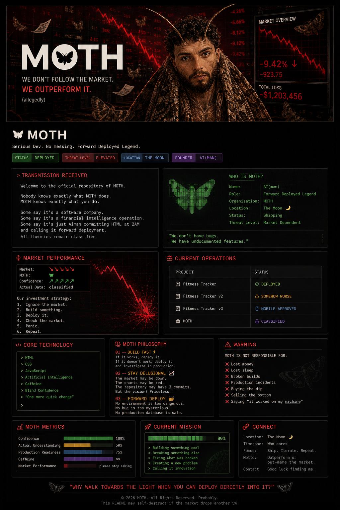

<div align="center">



<br/>

# 🦋 M O T H

### Serious Dev. No messing. Forward Deployed Legend.


</div>

---

# 📡 TRANSMISSION RECEIVED

Welcome to the official repository of **MOTH**.

Nobody knows exactly what MOTH does.

MOTH knows exactly what **you** do.

Some say it's a software company.

Some say it's a financial intelligence operation.

Some say it's just Aiman committing HTML at 2AM and calling it *forward deployment*.

All theories remain classified.

---

# 🧑‍💻 WHO IS MOTH?

```text
Name:           AI(man)
Role:           Forward Deployed Legend
Organisation:   MOTH
Location:       The Moon 🌙
Status:         Shipping
Threat Level:   Market Dependent
```

> **"We don't have bugs. We have undocumented features."**

---

# 📈 MARKET PERFORMANCE

```text
Market:        📉📉📉📉📉
MOTH:          🦋
Confidence:    📈
Actual Data:   classified
```

### Our investment strategy:

1. Ignore the market.
2. Build something.
3. Deploy it.
4. Check the market.
5. Panic.
6. Repeat.

---

# 🚀 CURRENT OPERATIONS

| Project | Status |
|---|---|
| 🏋️ Fitness Tracker | 🟢 **DEPLOYED** |
| 🏋️ Fitness Tracker v2 | 🟡 **Somehow worse** |
| 🏋️ Fitness Tracker v3 | 📱 **Mobile approved** |
| 🦋 MOTH | 🟣 **CLASSIFIED** |

---

# 🧠 CORE TECHNOLOGY

```text
> HTML
> CSS
> JavaScript
> Artificial Intelligence
> Caffeine
> Blind Confidence
> "One more quick change"
```

---

# 🦋 THE MOTH PHILOSOPHY

> ## "Why walk towards the light when you can deploy directly into it?"

### 01 — BUILD FAST ⚡

If it works, deploy it.

If it doesn't work, deploy it and investigate in production.

---

### 02 — STAY DELUSIONAL 📈

The market may be down.

The charts may be red.

The repository may have 3 commits.

But the vision?

# Priceless.

---

### 03 — FORWARD DEPLOY 🫡

No environment is too dangerous.

No bug is too mysterious.

No production database is safe.

---

# ⚠️ WARNING

```text
MOTH IS NOT RESPONSIBLE FOR:

❌ Lost money
❌ Lost sleep
❌ Broken builds
❌ Production incidents
❌ Buying the dip
❌ Selling the bottom
❌ Saying "it worked on my machine"
```

---

# 📊 MOTH METRICS

```text
Confidence              ████████████████████ 100%

Actual Understanding    ██████████░░░░░░░░░░ 50%

Production Readiness    ███████████████░░░░░ 75%

Caffeine                ████████████████████ ∞

Market Performance      ██░░░░░░░░░░░░░░░░░░ please stop asking
```

---

# 🛰️ CURRENT MISSION

```text
[████████████████░░░░]  80%

> Building something cool
> Breaking something else
> Fixing what was broken
> Creating a new problem
> Calling it innovation
```

---

# 🧬 CONTRIBUTION POLICY

Contributions are welcome.

Probably.

Please ensure your pull request:

- Does not break production.
- If it does, has a convincing explanation.
- Includes at least one unnecessarily ambitious feature.
- Respects the MOTH philosophy.
- Has been tested on *your machine*.

---

# 🛰️ CONNECT

```text
Location:     The Moon 🌙
Timezone:     Who cares
Focus:        Ship. Iterate. Repeat.
Motto:        Outperform or out-meme the market.
Contact:      Good luck finding me.
```

---

<div align="center">

# 🦋 MOTH

### Serious Dev. No messing. Forward Deployed Legend.

## We don't follow the market.

# WE OUTPERFORM IT.

<sub>*results may vary*</sub>

<br/>

> **"Why walk towards the light when you can deploy directly into it?"**

<br/>

<sub>© 2026 MOTH. All rights reserved. Probably.</sub>

</div>
